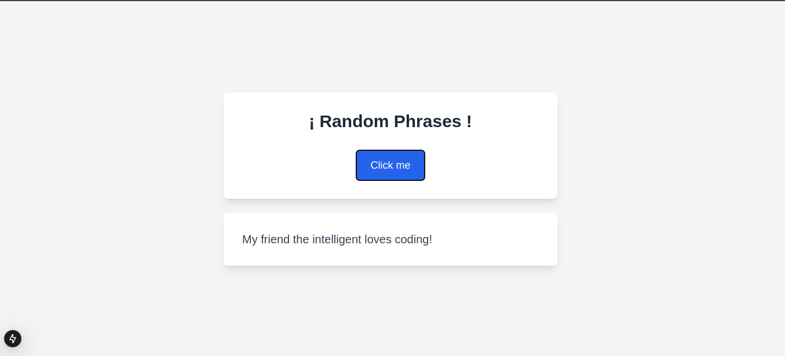

# API Phrase Generator Dockerized Project

This project demonstrates a simple **Next.js** application to generate sentences, fully containerized using Docker. The application generates som phrases taht are calles from an API and are mixed randomly.

## Features

- Phrases generator.
- Intuitive web interface with real-time responses.
- Fully Dockerized for portability and consistency.

## Prerequisites

- Docker version 27.4.1 or higher.
- Docker Compose version v2.32.2 or higher.

## Project Structure

```
phrase-generator/
├── app/                  # Next.js App Directory containing pages and API routes
├── Dockerfile            # Docker configuration for the app
├── next.config.ts        # Next.js configuration file
├── public/               # Static assets
├── tsconfig.json         # TypeScript configuration
└── README.md             # Documentation
```

## Backend and Frontend Explanation

### Backend
- **Type:** Serverless API (via Next.js API Routes).
- **Location:** `app/api/data/route.ts`
- **Purpose:** Generates som phrases taht are calles from an API and are mixed randomly
- **How it works:** Acts as a stateless function triggered by HTTP requests.

### Frontend
- **Type:** Client-side React Application.
- **Location:** `app/page.tsx`
- **Purpose:**
  - Provides the user interface for button and result display.
  - Sends the user's input to the backend API.
  - Displays the API response (results or errors) in real-time.

## How to Install and Run

### Clone this repository:

```bash
git clone https://github.com/JuanAmezquitaAgredo/Docker-Phrase-Generator
cd Docker-Phrase-Generator
```

### Build the Docker image:

```bash
docker build -t Docker-Phrase-Generator .
```

### Start the container in development mode:

```bash
docker run -p 3000:3000 Docker-Phrase-Generator
```

### Access the application:

Open your browser and navigate to:

```
http://localhost:3000
```

## How the Application Works

1. Users are presented with a simple, modern interface.
2. They click on the button.
3. The backend API choooses a subject and a predicate at random
4. The results are displayed in real-time on the interface.

## Docker Commands for Beginners

### Build the Image

To build the Docker image:

```bash
docker build -t Docker-Phrase-Generator .
```

### Run the Application

Run the application interactively:

```bash
docker run -p 3000:3000 Docker-Phrase-Generator
```

### Stop and Remove Containers

Stop all running containers:

```bash
docker stop $(docker ps -q)
```

Remove all containers:

```bash
docker rm $(docker ps -a -q)
```

### Remove All Unused Resources

To clean up unused Docker images, containers, and networks:

```bash
docker system prune -a
```

### Check Running Containers

List all active containers:

```bash
docker ps
```

## Dependencies

- **Next.js 13**: The React framework used for building the application.
- **TailwindCSS**: For styling the application.
- **Docker**: Ensures the app runs in a consistent environment.
- **TypeScript**: Provides static typing for better maintainability.

All dependencies are managed within Docker, so no additional installations are required on your host system.

## Notes

- This project is designed for learning and experimentation with Next.js and Docker.
- The application runs entirely inside the container, ensuring a consistent environment across different systems.
---

## Add Examples


